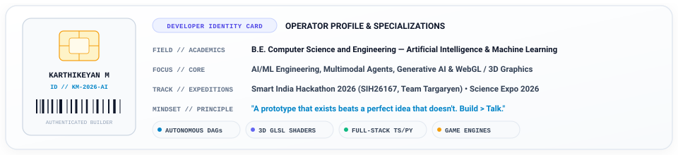
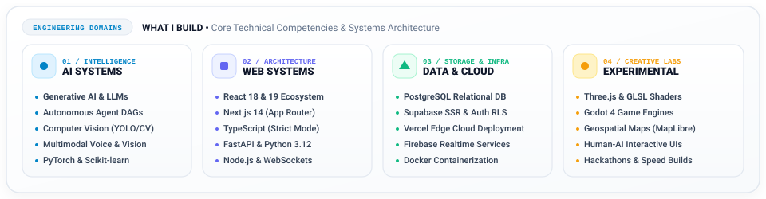
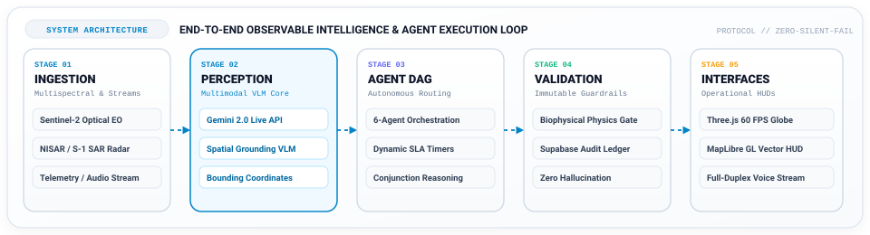
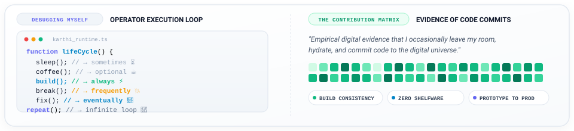
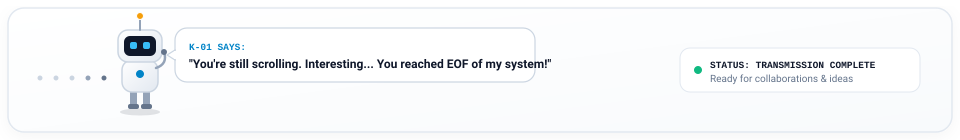

<div align="center">

<!-- ======================================================== -->
<!-- 01. HERO BANNER: KARTHI // SYSTEM ONLINE                -->
<!-- ======================================================== -->
<picture>
  <source media="(prefers-color-scheme: dark)" srcset="./assets/hero.svg">
  <source media="(prefers-color-scheme: light)" srcset="./assets/hero.svg">
  
</picture>

<br/>

<!-- ======================================================== -->
<!-- QUICK LAUNCHPAD PILLS                                    -->
<!-- ======================================================== -->
<p align="center">
  <a href="https://karthi-portfolio-delta.vercel.app">
    
  </a>
  &nbsp;
  <a href="https://earthmind.vercel.app">
    
  </a>
  &nbsp;
  <a href="https://github.com/karthibaraniofficial-wq">
    
  </a>
  &nbsp;
  <a href="mailto:karthibaraniofficial@gmail.com">
    
  </a>
</p>

</div>

<br/>

<!-- ======================================================== -->
<!-- 02. BOOT SEQUENCE CONSOLE                                -->
<!-- ======================================================== -->
<div align="center">
<picture>
  <source media="(prefers-color-scheme: dark)" srcset="./assets/boot-terminal.svg">
  <source media="(prefers-color-scheme: light)" srcset="./assets/boot-terminal.svg">
  
</picture>
</div>

<br/>

<!-- ======================================================== -->
<!-- 03. MEET K-01: THE UNOFFICIAL ASSISTANT                  -->
<!-- ======================================================== -->
<div align="center">
<picture>
  <source media="(prefers-color-scheme: dark)" srcset="./assets/k01-assistant.svg">
  <source media="(prefers-color-scheme: light)" srcset="./assets/k01-assistant.svg">
  
</picture>
</div>

<br/>

<!-- ======================================================== -->
<!-- 04. DEVELOPER IDENTITY CARD                              -->
<!-- ======================================================== -->
<div align="center">
<picture>
  <source media="(prefers-color-scheme: dark)" srcset="./assets/identity-card.svg">
  <source media="(prefers-color-scheme: light)" srcset="./assets/identity-card.svg">
  
</picture>
</div>

<br/>

<!-- ======================================================== -->
<!-- 05. WHAT I BUILD: ENGINEERING DOMAINS                    -->
<!-- ======================================================== -->
<div align="center">
<picture>
  <source media="(prefers-color-scheme: dark)" srcset="./assets/domains.svg">
  <source media="(prefers-color-scheme: light)" srcset="./assets/domains.svg">
  
</picture>
</div>

<br/>

---

## ⚡ 01 — VERIFIED TECHNICAL FABRIC

<table>
  <tr>
    <td width="50%" valign="top">
      <h4>🧠 Artificial Intelligence &amp; Machine Learning</h4>
      <ul>
        <li><b>Foundation Models:</b> Google Gemini 2.0 Live API, Claude, OpenAI, Ollama Local Models</li>
        <li><b>Frameworks:</b> PyTorch, TensorFlow, Scikit-learn, XGBoost, Hugging Face Transformers</li>
        <li><b>Agent Orchestration:</b> Multi-Agent DAGs, Autonomous Routing Engines, ReAct Agents</li>
        <li><b>Perception:</b> Computer Vision (OpenCV, YOLO), Vision-Language Models (VLM)</li>
      </ul>
    </td>
    <td width="50%" valign="top">
      <h4>🌐 Frontend, 3D Graphics &amp; Spatial HUDs</h4>
      <ul>
        <li><b>Core Languages:</b> TypeScript 5.9 (Strict), Modern JavaScript (ESNext)</li>
        <li><b>UI Frameworks:</b> React 19 / 18, Next.js 14 (App Router), Vite 6, Tailwind CSS</li>
        <li><b>3D &amp; WebGL:</b> Three.js, Custom GLSL Shaders (Rayleigh Scattering), React Three Fiber (R3F)</li>
        <li><b>Geospatial Mapping:</b> MapLibre GL, deck.gl, Turf.js Geometric Math, React-Leaflet</li>
      </ul>
    </td>
  </tr>
  <tr>
    <td width="50%" valign="top">
      <h4>🛠️ Backend Systems &amp; Real-Time Data</h4>
      <ul>
        <li><b>Runtimes &amp; APIs:</b> Python 3.12+ (FastAPI), Node.js, RESTful OpenAPI, WebSockets</li>
        <li><b>Databases &amp; SSR:</b> PostgreSQL, Supabase (Row Level Security &amp; Realtime), Firebase</li>
        <li><b>Edge &amp; Infra:</b> Vercel Edge Network, Docker Containerization, Linux Environments</li>
        <li><b>Protocols:</b> Server-Sent Events (SSE), Full-Duplex Audio Streaming, RPC</li>
      </ul>
    </td>
    <td width="50%" valign="top">
      <h4>🎮 Game Engines &amp; Simulation Laboratories</h4>
      <ul>
        <li><b>Engines:</b> Godot 4 Engine (GDScript), WebGodot / WebAssembly Exports</li>
        <li><b>Procedural R&amp;D:</b> Algorithmic Terrain Heightmaps, Procedural Mesh Generation</li>
        <li><b>Audio &amp; Systems:</b> Python Dynamic Soundscape Synthesis, Deterministic State Loops</li>
        <li><b>Engineering Tooling:</b> Git, GitHub, Figma, VS Code, Antigravity IDE</li>
      </ul>
    </td>
  </tr>
</table>

<br/>

<div align="center">
  
</div>

<br/>

---

## 🌍 02 — FLAGSHIP PLATFORM: EARTHMIND

### Planetary Environmental Intelligence Operating System &amp; 3D Digital Twin
> *Explore Earth's Past. Understand Its Present. Simulate Its Future.*  
> **Status:** Production Live • Science Expo 2026 Edition &nbsp;|&nbsp; **Architecture:** Three.js Photorealistic 3D Globe + Google Gemini 2.0 Live Voice

<br/>

<div align="center">
<picture>
  <source media="(prefers-color-scheme: dark)" srcset="./assets/flagship-earthmind.svg">
  <source media="(prefers-color-scheme: light)" srcset="./assets/flagship-earthmind.svg">
  
</picture>
</div>

<br/>

**EARTHMIND** is an enterprise-grade planetary environmental intelligence platform and interactive digital twin. It integrates real-world satellite remote sensing data, dynamic atmospheric physics, and a multimodal conversational copilot powered by **Google Gemini 2.0 Live**:

- **Photorealistic 3D Earth Visualization:** Custom GLSL shaders calculating atmospheric Rayleigh scattering, dynamic cloud formation layers, high-resolution terrain mapping, and day/night terminators rendered at 60 FPS in Three.js.
- **Multimodal Voice Copilot:** Low-latency conversational intelligence via Google Gemini 2.0 Live API (`@google/genai`), allowing operators to query planetary state through natural voice dialog with sub-180ms latency.
- **Biophysical What-If Simulations:** Real-time environmental perturbation engine enforcing physical climate equilibrium guardrails to eliminate unphysical hallucinations.
- **Production Status:** Deployed and actively operational on Vercel Edge Cloud.

<p align="center">
  <a href="https://earthmind.vercel.app">
    
  </a>
  &nbsp;
  <a href="https://github.com/karthibaraniofficial-wq/EARTHMIND">
    
  </a>
  &nbsp;
  
  &nbsp;
  
</p>

<br/>

---

## 📐 03 — SYSTEM ARCHITECTURE &amp; OPERATIONAL PIPELINE

<div align="center">
<picture>
  <source media="(prefers-color-scheme: dark)" srcset="./assets/architecture.svg">
  <source media="(prefers-color-scheme: light)" srcset="./assets/architecture.svg">
  
</picture>
</div>

<br/>

Every intelligent platform in this portfolio follows an **observable, deterministic data loop**:

```text
MULTIMODAL SENSORS (Sentinel Optical, SAR Radar, Telemetry, Voice)
        ↓
PERCEPTION CORE (Gemini 2.0 Live, VLMs, Bounding Coordinate Grounding)
        ↓
AUTONOMOUS AGENT DAG (Routing, SLA Calculation, Conjunction Simulation)
        ↓
DETERMINISTIC VALIDATION (Biophysical Guardrails, Append-Only Audit Ledger)
        ↓
OPERATIONAL 3D INTERFACE (Three.js 60FPS Globe, MapLibre GL HUD)
```

1. **Multimodal Grounding:** Raw inputs are processed through spatial coordinate projections and spectral band indices—never hallucinated free text.
2. **Autonomous Agent Specialization:** Pipelines are decomposed into single-responsibility agents with explicit input/output schemas and dynamic SLA timers.
3. **Immutable Verification:** Every execution step logs model latency, confidence scores, and raw scene provenance IDs.

<br/>

---

## 🚀 04 — FEATURED ACTIVE SYSTEMS REGISTRY

<table width="100%" cellspacing="0" cellpadding="6" border="0">
  <tr>
    <!-- CARD 1: ASTRA-SENTINEL -->
    <td width="50%" valign="top">
      <table width="100%" cellspacing="0" cellpadding="10" border="1" style="border-collapse:collapse; border-color:#e2e8f0;">
        <tr>
          <td>
            <div align="right"><code>SYS_ID: 01</code> &nbsp; </div>
            <h3>🛰️ ASTRA-SENTINEL</h3>
            <p><b>AI Space Situational Awareness &amp; Satellite Fleet Command</b></p>
            <p>High-reliability space mission control platform featuring multi-agent orbital risk assessment, debris conjunction analysis, and deterministic temporal event replay engine with append-only audit trails.</p>
            <p><b>Stack:</b> <code>TypeScript</code> · <code>FastAPI</code> · <code>Orbital Mechanics</code> · <code>Three.js</code> · <code>Multi-Agent DAG</code></p>
            <p><b>Highlights:</b> Real-time orbital propagation, sub-kilometer conjunction warnings, and human-in-the-loop review gates.</p>
            <hr style="border-color:#e2e8f0;"/>
            <div align="center">
              <a href="https://github.com/karthibaraniofficial-wq"><b>[ View Mission Control Repository → ]</b></a>
            </div>
          </td>
        </tr>
      </table>
    </td>
    <!-- CARD 2: SATQUERY AI -->
    <td width="50%" valign="top">
      <table width="100%" cellspacing="0" cellpadding="10" border="1" style="border-collapse:collapse; border-color:#e2e8f0;">
        <tr>
          <td>
            <div align="right"><code>SYS_ID: 02</code> &nbsp; </div>
            <h3>📡 SatQuery AI</h3>
            <p><b>Multimodal Earth Observation Vision-Language Copilot</b></p>
            <p>Engineered for <b>Smart India Hackathon 2026 (SIH26167, Team Targaryen)</b>. Unifies optical satellite imagery (Sentinel-2) and Synthetic Aperture Radar (Sentinel-1, ISRO-NASA NISAR) for all-weather spatial QA and cloud penetration.</p>
            <p><b>Stack:</b> <code>React</code> · <code>TypeScript</code> · <code>MapLibre GL</code> · <code>deck.gl</code> · <code>R3F</code> · <code>Turf.js</code></p>
            <p><b>Highlights:</b> Bypasses cloud cover with SAR radar fusion; sub-meter bounding coordinate grounding.</p>
            <hr style="border-color:#e2e8f0;"/>
            <div align="center">
              <a href="https://github.com/karthibaraniofficial-wq"><b>[ SIH 2026 Team Targaryen Repository → ]</b></a>
            </div>
          </td>
        </tr>
      </table>
    </td>
  </tr>

  <tr>
    <!-- CARD 3: CIVICFLOW AI / CIVILAI -->
    <td width="50%" valign="top">
      <table width="100%" cellspacing="0" cellpadding="10" border="1" style="border-collapse:collapse; border-color:#e2e8f0;">
        <tr>
          <td>
            <div align="right"><code>SYS_ID: 03</code> &nbsp; </div>
            <h3>🏛️ CIVICFLOW AI (CIVILAI)</h3>
            <p><b>Autonomous Civic Grievance Orchestrator &amp; Dispatch DAG</b></p>
            <p>Replaces municipal bottleneck desks with a 6-agent autonomous pipeline: Complaint Understanding, Computer Vision Hazard Detection (1-10 severity index), Automated Department Routing, Dynamic SLA Calculation, and Tamper-Proof Audit Logging.</p>
            <p><b>Stack:</b> <code>Python 3.12</code> · <code>FastAPI</code> · <code>Computer Vision</code> · <code>Supabase RLS</code> · <code>React</code></p>
            <p><b>Highlights:</b> Sub-850ms dispatch latency; eliminates manual triage with tamper-proof audit logs.</p>
            <hr style="border-color:#e2e8f0;"/>
            <div align="center">
              <a href="https://civilai-mu.vercel.app"><b>[ Open Live App ↗ ]</b></a> &nbsp;&nbsp;|&nbsp;&nbsp;
              <a href="https://github.com/karthibaraniofficial-wq/CIVILAI"><b>[ View Source Code → ]</b></a>
            </div>
          </td>
        </tr>
      </table>
    </td>
    <!-- CARD 4: LINUXPILOT AI -->
    <td width="50%" valign="top">
      <table width="100%" cellspacing="0" cellpadding="10" border="1" style="border-collapse:collapse; border-color:#e2e8f0;">
        <tr>
          <td>
            <div align="right"><code>SYS_ID: 04</code> &nbsp; </div>
            <h3>🐧 LinuxPilot AI</h3>
            <p><b>Intelligent Natural-Language Linux Operations Layer</b></p>
            <p>An autonomous operations assistant and telemetry monitor for Linux systems. Operators query server health, diagnose bottlenecks, inspect active processes, and trigger safe maintenance commands via natural-language adapters.</p>
            <p><b>Stack:</b> <code>Python</code> · <code>FastAPI</code> · <code>Ollama Adapters</code> · <code>React 18</code> · <code>Tailwind CSS</code></p>
            <p><b>Highlights:</b> Double-gate safety verification for destructive commands; 45ms telemetry stream.</p>
            <hr style="border-color:#e2e8f0;"/>
            <div align="center">
              <a href="https://linuxpilot.vercel.app"><b>[ Open Live App ↗ ]</b></a> &nbsp;&nbsp;|&nbsp;&nbsp;
              <a href="https://github.com/karthibaraniofficial-wq/linuxpilot"><b>[ View Source Code → ]</b></a>
            </div>
          </td>
        </tr>
      </table>
    </td>
  </tr>

  <tr>
    <!-- CARD 5: ETERNAL LINK -->
    <td width="50%" valign="top">
      <table width="100%" cellspacing="0" cellpadding="10" border="1" style="border-collapse:collapse; border-color:#e2e8f0;">
        <tr>
          <td>
            <div align="right"><code>SYS_ID: 05</code> &nbsp; </div>
            <h3>⚔️ ETERNAL LINK</h3>
            <p><b>3D Romantic Fantasy Multiplayer RPG &amp; World Simulation</b></p>
            <p>Real-time 3D multiplayer world exploration, networked player state synchronization, dynamic quest graphs, and stylized fantasy environments rendered with real-time browser shaders.</p>
            <p><b>Stack:</b> <code>Godot 4</code> · <code>GDScript</code> · <code>WebAssembly</code> · <code>Python Network Sockets</code></p>
            <p><b>Highlights:</b> Deterministic state interpolation, zero-GC game loop, and dynamic atmospheric lighting.</p>
            <hr style="border-color:#e2e8f0;"/>
            <div align="center">
              <a href="https://github.com/karthibaraniofficial-wq"><b>[ View Game Engine Repository → ]</b></a>
            </div>
          </td>
        </tr>
      </table>
    </td>
    <!-- CARD 6: XAURALYS -->
    <td width="50%" valign="top">
      <table width="100%" cellspacing="0" cellpadding="10" border="1" style="border-collapse:collapse; border-color:#e2e8f0;">
        <tr>
          <td>
            <div align="right"><code>SYS_ID: 06</code> &nbsp; </div>
            <h3>✨ XAURALYS (Auralis)</h3>
            <p><b>Multimodal Generative Intelligence Companion</b></p>
            <p>Experimental multimodal application built directly on Google AI Studio's Gemini foundation models. Explores zero-latency audio-visual reasoning, empathetic conversational grounding, and intuitive web interactions.</p>
            <p><b>Stack:</b> <code>TypeScript</code> · <code>Google Gemini Multimodal API</code> · <code>WebSockets</code></p>
            <p><b>Highlights:</b> Full-duplex audio stream analysis; adaptive conversational persona.</p>
            <hr style="border-color:#e2e8f0;"/>
            <div align="center">
              <a href="https://ai.studio/apps/35bda2ff-57bc-41ff-9fcd-8685f8fc704d"><b>[ Open in AI Studio ↗ ]</b></a> &nbsp;&nbsp;|&nbsp;&nbsp;
              <a href="https://github.com/karthibaraniofficial-wq/XAURALYS"><b>[ View Source Code → ]</b></a>
            </div>
          </td>
        </tr>
      </table>
    </td>
  </tr>

  <tr>
    <!-- CARD 7: ROADMEMORYAI -->
    <td width="50%" valign="top">
      <table width="100%" cellspacing="0" cellpadding="10" border="1" style="border-collapse:collapse; border-color:#e2e8f0;">
        <tr>
          <td>
            <div align="right"><code>SYS_ID: 07</code> &nbsp; </div>
            <h3>🛣️ ROADMEMORYAI</h3>
            <p><b>Geospatial Infrastructure Intelligence &amp; Surface Analytics</b></p>
            <p>Spatial intelligence studio tracking road surface degradation, maintenance history, and telemetry anomalies over time with interactive map layers and dynamic timeline scrubbers.</p>
            <p><b>Stack:</b> <code>Next.js 14</code> · <code>React-Leaflet</code> · <code>Recharts</code> · <code>Supabase SSR</code> · <code>TypeScript</code></p>
            <p><b>Highlights:</b> 5-Year deterioration curve modeling; sub-meter coordinate bounding.</p>
            <hr style="border-color:#e2e8f0;"/>
            <div align="center">
              <a href="https://github.com/karthibaraniofficial-wq/ROADMEMORYAI"><b>[ View Source Code → ]</b></a>
            </div>
          </td>
        </tr>
      </table>
    </td>
    <!-- CARD 8: UPCYCLE AI -->
    <td width="50%" valign="top">
      <table width="100%" cellspacing="0" cellpadding="10" border="1" style="border-collapse:collapse; border-color:#e2e8f0;">
        <tr>
          <td>
            <div align="right"><code>SYS_ID: 08</code> &nbsp; </div>
            <h3>♻️ UPCYCLE AI (UPCYCLEAIV1)</h3>
            <p><b>Computer Vision Waste Classification &amp; Circular Economy</b></p>
            <p>Computer vision platform analyzing discarded materials (textiles, polymers, electronics) to predict circular upcycling pathways and calculate automated CO2 offset metrics.</p>
            <p><b>Stack:</b> <code>Computer Vision</code> · <code>PyTorch</code> · <code>OpenCV</code> · <code>FastAPI</code> · <code>React</code></p>
            <p><b>Highlights:</b> 93.2% mAP classification accuracy; 38ms inference speed per frame.</p>
            <hr style="border-color:#e2e8f0;"/>
            <div align="center">
              <a href="https://github.com/karthibaraniofficial-wq/UPCYCLEAIV1"><b>[ View Source Code → ]</b></a>
            </div>
          </td>
        </tr>
      </table>
    </td>
  </tr>
</table>

<br/>

<!-- ======================================================== -->
<!-- 05. CURRENTLY BUILDING LIVE TELEMETRY                     -->
<!-- ======================================================== -->
<div align="center">
<picture>
  <source media="(prefers-color-scheme: dark)" srcset="./assets/currently-building.svg">
  <source media="(prefers-color-scheme: light)" srcset="./assets/currently-building.svg">
  
</picture>
</div>

<br/>

---

## 📊 05 — TELEMETRY &amp; GITHUB METRICS

<div align="center">

<table border="0" cellspacing="0" cellpadding="6">
  <tr>
    <td align="center" valign="middle">
      
    </td>
    <td align="center" valign="middle">
      
    </td>
  </tr>
</table>

<br/>


</div>

<br/>

<!-- ======================================================== -->
<!-- 06. THE CONTRIBUTION MATRIX & DEBUGGING MYSELF           -->
<!-- ======================================================== -->
<div align="center">
<picture>
  <source media="(prefers-color-scheme: dark)" srcset="./assets/debugging-matrix.svg">
  <source media="(prefers-color-scheme: light)" srcset="./assets/debugging-matrix.svg">
  
</picture>
</div>

<br/>

---

## 💡 07 — PHILOSOPHY: BUILD > TALK

<table width="100%" cellspacing="0" cellpadding="12" border="1" style="border-collapse:collapse; border-color:#e2e8f0;">
  <tr>
    <td align="left">
      <h3>◈ BUILD &gt; TALK</h3>
      <p><i>"I like turning ideas into working systems. A prototype that exists beats a perfect idea that doesn't."</i></p>
      <p>Engineering is not about accumulating buzzwords or writing slides. It's about designing strictly typed contracts, constructing observable agent DAGs, writing custom GLSL shaders that hit 60 FPS, and shipping real code to operators.</p>
    </td>
  </tr>
</table>

<br/>

---

## 🗺️ 08 — NEXT TRANSMISSION

- [x] **Autonomous Agent DAGs:** Architect deterministic multi-agent routing engines with SLA calculations (CIVICFLOW AI)
- [x] **Planetary Digital Twin:** Render 60 FPS Three.js GLSL Rayleigh shaders + Google Gemini 2.0 Live voice (EARTHMIND)
- [x] **SAR Earth Observation:** Engineer all-weather radar/optical vision copilot for SIH 2026 (SatQuery AI, Team Targaryen)
- [x] **Natural-Language Linux Layer:** Ship production-ready terminal operations assistant with double-gate safety (LinuxPilot AI)
- [ ] **ASTRA-SENTINEL Alpha:** Deploy space situational awareness engine with orbital conjunction warning DAGs
- [ ] **AI-Authored Worlds:** Train experimental agents capable of generating procedural game mechanics and shaders on the fly
- [ ] **Defy Browser Limits:** Build something utterly ridiculous and unexpected that pushes modern WebGL / WebGPU to the edge

<br/>

---

## 📡 09 — TRANSMISSION &amp; NETWORK

<div align="center">

<table border="0" cellspacing="0" cellpadding="8">
  <tr>
    <td align="center">
      <a href="https://karthi-portfolio-delta.vercel.app">
        
      </a>
    </td>
    <td align="center">
      <a href="https://earthmind.vercel.app">
        
      </a>
    </td>
    <td align="center">
      <a href="https://github.com/karthibaraniofficial-wq">
        
      </a>
    </td>
    <td align="center">
      <a href="mailto:karthibaraniofficial@gmail.com">
        
      </a>
    </td>
  </tr>
</table>

<p>
  <sub><i>Open for collaborative research in autonomous AI agents, planetary digital twins, geospatial radar intelligence, or hackathon expeditions.</i></sub>
</p>

</div>

<br/>

<!-- ======================================================== -->
<!-- 10. FINAL EASTER EGG: K-01 WALKING FOOTER                -->
<!-- ======================================================== -->
<div align="center">
<picture>
  <source media="(prefers-color-scheme: dark)" srcset="./assets/k01-footer.svg">
  <source media="(prefers-color-scheme: light)" srcset="./assets/k01-footer.svg">
  
</picture>
</div>
